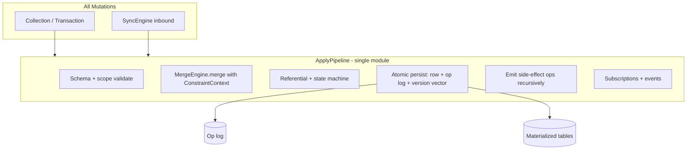
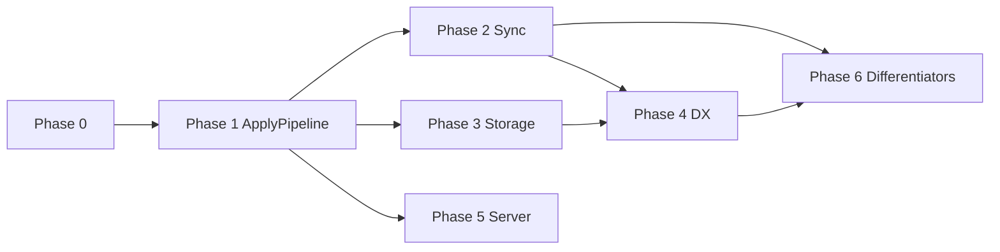

# Kora.js Best-in-Class Implementation Plan

This plan turns the senior implementation review into a sequenced build program. The goal is not to patch gaps but to deliver **one coherent data plane** where local writes and remote sync share the same correctness model, with adoption-grade developer experience on top.

**Scope:** Code implementation only. Tasks are derived from verified behavior in the monorepo (not outdated documentation).

**Related plans:**

- [Desktop & Mobile Implementation Plan](./desktop-mobile-implementation-plan.md)
- [Offline-First Auth Roadmap](./offline-first-auth-roadmap.md)

---

## North Star

**One sentence:** Every mutation—local or remote—flows through the same deterministic apply pipeline; sync is a transport for operations, not a second correctness model.

### Success Criteria (Measurable)

| Metric | Target |
|--------|--------|
| Multi-device convergence | 10 clients × 1k ops, 10% drop, 5% dup → identical materialized state in &lt;60s (real Store + merge path) |
| Multi-tab same origin | 2 tabs, concurrent writes → no duplicate sequence corruption, no OPFS corruption |
| Refresh + offline | 100 ops offline → refresh → connect → 100% on server; `pendingSync` accurate |
| Schema migration | v1 client + v2 server (and reverse) → explicit policy, no silent corruption |
| Op log size | 1M ops → compaction → bounded storage (&lt;2× materialized size) |
| Developer experience | `createApp({ schema, sync })` enables encryption, transport, scopes without manual `SyncEngine` |
| Adoption | `npx create-kora-app` → working synced app in &lt;10 min; IDE types on all CRUD |

---

## Current State (Verified in Code)

### What Works Today

- **Durability:** Every mutation persists to `_kora_ops_*` before sync. Recovery on reconnect uses version-vector delta via `sendDelta()` → `collectDelta()` → `getOperationRange()`, not the in-memory outbound queue.
- **Idempotency:** Content-addressed op IDs; client and server dedup on apply.
- **Materialization safety:** Remote applies use LWW guards on `_version` (`buildLwwUpdateQuery`, `buildLwwSoftDeleteQuery`).
- **Server:** `SqliteServerStore` dual-writes ops and rebuilds materialized rows by replaying the op log per record.
- **Merge engine:** Three-tier engine with property tests (commutativity, determinism, idempotency).
- **Sequences:** `SequenceManager` uses DB transactions with `(name, scope, node_id)` — correctly isolated per device.
- **Reactive queries:** `SubscriptionManager` with bloom-filter optimization and microtask batching.

### Architecture Today (Problem)

Three divergent apply paths:

```
LOCAL:  Collection → Store (RelationEnforcer on delete only)
REMOTE: MergeAwareSyncStore → mergeFields (updates only) → Store LWW
SERVER: op log → replay materialization
```

### Sync Send Paths (Two Channels)

```
Mutation → _kora_ops_* (durable)
         → pushOperation → OutboundQueue (ephemeral, in-memory)

Handshake  → sendDelta() reads op log
Streaming  → flushQueue() reads OutboundQueue
```

Implications:

- Refresh does **not** lose sync data (op log is source of truth).
- First connect after offline work may **duplicate sends** (sendDelta + flushQueue); harmless via dedup, wasteful.
- `pendingOperations` counts **queue only** — misleading after refresh.
- Only `MemoryQueueStorage` exists; no persistent `QueueStorage` implementation.

### Critical Gaps (P0)

1. **Remote deletes skip referential integrity** — local `Collection.delete()` runs `RelationEnforcer`; `applyRemoteOperation()` does not. `checkReferentialIntegrityOnDelete` in `@korajs/merge` is never wired outside tests.
2. **Delete vs update on sync bypasses `MergeEngine`** — `MergeAwareSyncStore` delegates non-updates to store LWW; zombie rows possible (`_deleted = 1` with mutated fields).
3. **Multi-tab same origin unhandled** — shared `node_id`, in-memory sequence numbers, separate WASM workers, hardcoded OPFS `kora.db`.
4. **OPFS `dbName` not passed to worker** — adapter accepts `dbName`; worker always opens `'kora.db'`.
5. **`createApp` does not wire** encryption, HTTP transport, Tier 2 constraints, or referential merge helpers.

### High-Priority Gaps (P1)

- Sync apply uses `mergeFields()` only, not `merge()` with `ConstraintContext`.
- `causalDeps: []` on all normal CRUD; DAG model unused.
- No operation log compaction.
- IndexedDB fallback: full DB snapshot on every `execute`/`transaction`.
- Silent failures: `handleOperationBatch` swallows errors; `ClockDriftError` → `skipped` without surfacing.
- Schema version exchanged but not enforced; no op transforms.
- `@korajs/test` TestDevice bypasses `MergeAwareSyncStore`; chaos tests use mock stores.

---

## Architectural Pivot: Unified Apply Pipeline

**Target architecture:**



**Recommended location:** `kora/src/apply-pipeline.ts` (meta-package internal first; extract to `@korajs/runtime` later if needed).

**Public responsibilities:**

- `ApplyPipeline.apply(op, context: ApplyContext)`
- `ApplyPipeline.applyLocal(mutation)`
- `ApplyPipeline.applyBatch(ops)` for sync (ordered, with explicit failure policy)

`Store` becomes storage orchestration; `Collection` becomes a thin facade over `ApplyPipeline`.

---

## Anti-Patterns Explicitly Forbidden

| Bandage (not allowed) | State-of-the-art replacement |
|----------------------|------------------------------|
| Document that queue isn't persistent | Pending sync from op log + ack watermark |
| Tell users not to use two tabs | Leader election + BroadcastChannel |
| Call `mergeFields` for speed | Full `merge()` with `ConstraintContext` |
| Skip cascade on remote delete | Pipeline applies referential integrity everywhere |
| Poll `useSyncStatus` every 500ms | Event-driven from sync engine |
| Swallow apply errors in batch | Per-op result + retry policy |
| Full IDB snapshot per SQL statement | Coalesced persistence |
| Hardcode `kora.db` | Plumb `dbName` through worker |

---

## Phase 0: Foundations (2–3 weeks)

Establish invariants before feature work.

### Epic 0.1 — Production Path Test Matrix

| ID | Task | Done when |
|----|------|-----------|
| 0.1.1 | Define `PRODUCTION_PATH` test tag: Store + MergeAwareSyncStore + SyncEngine + real SQLite | CI job runs on every PR |
| 0.1.2 | Add `createApp` integration test harness | `kora/tests/integration/create-app-sync.test.ts` covers offline→reconnect |
| 0.1.3 | Add intentional conflict fixtures: same-field update, delete vs update, insert vs insert, cascade delete | Fixtures reused in Phase 1+ |
| 0.1.4 | Add regression test: remote delete must cascade (expect red until Phase 1) | Drives implementation |
| 0.1.5 | Add multi-tab simulation test (two Store instances, same db path) | Documents failure mode |
| 0.1.6 | Benchmark baseline: WASM/OPFS + IndexedDB fallback | Numbers recorded internally |

### Epic 0.2 — Error and Observability Contract

| ID | Task | Done when |
|----|------|-----------|
| 0.2.1 | Define `ApplyResult` union: `applied \| duplicate \| rejected \| deferred` with reason codes | Types in `@korajs/core` |
| 0.2.2 | Replace silent `catch {}` in `SyncEngine.handleOperationBatch` with `sync:apply-failed` events | Every failure has `operationId`, `code`, `retriable` |
| 0.2.3 | Replace `ClockDriftError` → `skipped` with `rejected` + event + DevTools entry | Developer-visible |
| 0.2.4 | Wire `recordConflict()` from pipeline when merge runs | `useSyncStatus().conflicts` accurate |
| 0.2.5 | Add `unsyncedOperationCount` from op log vs last acked server vector | Not queue-only |

---

## Phase 1: Unified Apply Pipeline (4–6 weeks) — Critical Path

### Epic 1.1 — `ApplyPipeline` Core

| ID | Task | Implementation notes |
|----|------|----------------------|
| 1.1.1 | Create `ApplyPipeline` with `ApplyContext` (adapter, schema, clock, nodeId, mergeEngine, emitter, mode: `local` \| `remote`) | Single entry point |
| 1.1.2 | Remote updates: use full `mergeEngine.merge(input, constraintContext)` | `ConstraintContext` backed by Store queries |
| 1.1.3 | Remote deletes: `checkReferentialIntegrityOnDelete` + apply side effects as real ops in same transaction | Same as local delete |
| 1.1.4 | Delete vs update: route through `mergeWithDelete` when both ops target same record | No zombie deleted rows |
| 1.1.5 | Insert vs insert: `MergeEngine.merge` for same `recordId` collisions | Not only LWW row guard |
| 1.1.6 | Refactor `Collection.insert/update/delete` to call `ApplyPipeline` | All deletes through pipeline |
| 1.1.7 | `TransactionContext.commit()` emits ops through pipeline batch apply | Atomic multi-collection |
| 1.1.8 | Side-effect ops: pipeline returns `Operation[]`; persist, emit, queue for sync in order | Cascade ops sync |
| 1.1.9 | Build synthetic local op for 3-way merge from op log (not `updatedAt` + `logical: 0` hack) | Use latest local op per record |

### Epic 1.2 — Causal Dependencies (Real DAG)

| ID | Task | Done when |
|----|------|-----------|
| 1.2.1 | `CausalTracker` per device: last op id per collection + transaction boundary | |
| 1.2.2 | On each local op: `causalDeps = [lastOpInCollection, ...txnOps]` | Non-empty for sequential writes |
| 1.2.3 | Cascade side-effects: deps include parent delete op id | |
| 1.2.4 | Property test: random DAGs → apply order respects dependencies | `@korajs/core` |

### Epic 1.3 — Replace `MergeAwareSyncStore` Shim

| ID | Task | Done when |
|----|------|-----------|
| 1.3.1 | `MergeAwareSyncStore.applyRemoteOperation` → `pipeline.applyRemote(op)` | Thin wrapper |
| 1.3.2 | Remove duplicate merge logic from `merge-aware-sync-store.ts` | Single source of truth |
| 1.3.3 | Update `@korajs/test` TestDevice to use real MergeAware path | Convergence tests exercise pipeline |

**Phase 1 exit gate:** All `PRODUCTION_PATH` tests green, including cascade delete sync, delete vs update, concurrent field merge. *(Met in CI — `pnpm test:production-path` + sync-reconnect; korajs vitest resolves `@korajs/auth` from source.)*

---

## Phase 2: Sync Engine Hardening (3–4 weeks)

### Epic 2.1 — Durable Outbound State (Correct Semantics)

| ID | Task | Implementation notes |
|----|------|----------------------|
| 2.1.1 | Implement `StoreQueueStorage` via `_kora_sync_queue` table | Survives refresh |
| 2.1.2 | Reconcile queue vs op log on `SyncEngine.start()`: dedupe by op id | Single pending definition |
| 2.1.3 | Track `lastAckedServerVector` in `_kora_meta` | Accurate pending count |
| 2.1.4 | `getPendingSyncOperations()`: ops where server vector behind local | Powers status + DevTools |
| 2.1.5 | Eliminate duplicate send on connect: sendDelta OR flushQueue for same ops, not both | |
| 2.1.6 | Optional delta ACK wait before `deltaSendComplete` (`strictHandshake: true`) | Large sync backpressure |

### Epic 2.2 — `createApp` Wires All Sync Features

| ID | Task | Done when |
|----|------|-----------|
| 2.2.1 | Add `encryption?: SyncEncryptionConfig` to `kora` `SyncOptions` | |
| 2.2.2 | `initializeAsync`: `await SyncEncryptor.create()` when enabled | Passed to SyncEngine |
| 2.2.3 | Transport factory: `websocket` \| `http` selects implementation | No hardcoded WebSocket |
| 2.2.4 | Default `queueStorage: new StoreQueueStorage(store)` | Zero config |
| 2.2.5 | Optional `autoConnect: true` on sync config | Templates can enable |

### Epic 2.3 — Schema Version Protocol

| ID | Task | Done when |
|----|------|-----------|
| 2.3.1 | Server handshake: reject unsupported `schemaVersion` with `SCHEMA_MISMATCH` | Include min/max |
| 2.3.2 | Client: emit `sync:schema-mismatch`, enter blocked state | Clear error |
| 2.3.3 | Define `OperationTransform` interface in `@korajs/core` | |
| 2.3.4 | CLI `kora migrate` outputs op transform module where possible | |
| 2.3.5 | Integration test: v1 client + v2 server with transform converges | |

---

## Phase 3: Storage Layer — Production Grade (3–4 weeks)

### Epic 3.1 — Multi-Tab and Multi-Instance

| ID | Task | Implementation notes |
|----|------|----------------------|
| 3.1.1 | Tab leader election via `navigator.locks` (`kora-leader-${dbName}`) | Followers use BroadcastChannel RPC |
| 3.1.2 | Config `isolation: 'per-tab'` → unique `node_id` per tab | Document tradeoff |
| 3.1.3 | DB-backed `nextSequenceNumber()` in transaction | No in-memory seq |
| 3.1.4 | Pass `dbName` through worker `open` message for OPFS | Fix hardcoded `kora.db` |
| 3.1.5 | (Stretch) SharedWorker: single SQLite worker per origin | Performance |
| 3.1.6 | E2E: two tabs, concurrent inserts, converge via sync | Playwright |

### Epic 3.2 — IndexedDB Fallback Redesign

| ID | Task | Done when |
|----|------|-----------|
| 3.2.1 | Coalesced persistence: debounce snapshots (e.g. 500ms, flush on `visibilitychange`) | |
| 3.2.2 | `persistSnapshot` failures → `PersistenceError` event | Not swallowed |
| 3.2.3 | Storage quota handler: `store:quota-exceeded` event | |
| 3.2.4 | Perf gate: 1000 inserts &lt; 10s on IndexedDB adapter | CI |

### Epic 3.3 — Operation Log Compaction

| ID | Task | Implementation notes |
|----|------|----------------------|
| 3.3.1 | `CompactionStrategy` config: never \| after-days \| after-ack | |
| 3.3.2 | Snapshot materialized state as compaction baseline | |
| 3.3.3 | Truncate `_kora_ops_*` where all nodes acked through watermark | |
| 3.3.4 | `kora compact` CLI + optional background compaction | |
| 3.3.5 | Test: compact → reconnect → still fully synced | |

---

## Phase 4: Developer Experience — Adoption Layer (3–4 weeks)

### Epic 4.1 — `createApp` as the Product

| ID | Task | Done when |
|----|------|-----------|
| 4.1.1 | Audit and fix typed collections on `KoraApp` (full field inference) | |
| 4.1.2 | `app.sync.status` reactive getter for non-React | |
| 4.1.3 | `onSyncEvent` callback on `createApp` | |
| 4.1.4 | Actionable `KoraError` with `code` + `fix` suggestion | |
| 4.1.5 | Init validation: schema, sync URL, `workerUrl` in browser | Fail fast |
| 4.1.6 | Vue/Svelte template or bindings stub | |

### Epic 4.2 — React Hooks Polish

| ID | Task | Done when |
|----|------|-----------|
| 4.2.1 | `useSyncStatus` event-driven, not 500ms poll | |
| 4.2.2 | `useQuery` clear behavior when `!app.ready` (no silent `[]`) | |
| 4.2.3 | `useMutation` optimistic with rollback | |
| 4.2.4 | StrictMode double-mount test for QueryStore | |

### Epic 4.3 — CLI and Templates

| ID | Task | Done when |
|----|------|-----------|
| 4.3.1 | Template parity: `KoraProvider app={app}`, `workerUrl`, sync server | |
| 4.3.2 | `kora doctor`: OPFS, worker, sync, schema version checks | |
| 4.3.3 | `kora dev` embeds DevTools by default | |
| 4.3.4 | Optional codegen: `useTodos()` from schema | |

---

## Phase 5: Server and Security (2–3 weeks)

### Epic 5.1 — Server Authority

| ID | Task | Done when |
|----|------|-----------|
| 5.1.1 | Server-side Tier 2 constraint validation on ingest | Reject with `ErrorMessage` |
| 5.1.2 | Referential integrity on server materialization replay | |
| 5.1.3 | Rate limiting + op size limits per session | |
| 5.1.4 | Postgres path parity tests with SQLite server store | Done — live tests when `DATABASE_URL` is set |

### Epic 5.2 — Auth Integration (Streamlined)

| ID | Task | Done when |
|----|------|-----------|
| 5.2.1 | `createApp({ sync: { authClient } })` works with `@korajs/auth` out of box | Done — `createKoraAuthSync()` |
| 5.2.2 | Scope from JWT claims → `scopeMap` automatic | Done — `extractScopeValuesFromClaims()` |
| 5.2.3 | Device-bound sync identity separate from user id | Done — store `nodeId` from JWT `dev` claim |

---

## Phase 6: Advanced Differentiators (4–6 weeks)

### Epic 6.1 — Partial Sync / Live Queries

| ID | Task | Done when |
|----|------|-----------|
| 6.1.1 | Sync rules DSL in schema: `sync: { todos: { where: { userId: true } } }` | Done |
| 6.1.2 | Server filters delta by rules + auth scopes (unified model) | Done — `resolveSessionScopes()` |
| 6.1.3 | Client query-specific sync subsets | Done — `registerQuerySubset`, auto-register from `subscribe()` |
| 6.1.4 | Paginated delta with cursor + `isFinal` | Done — `cursor`, `totalBatches`, resume via handshake `deltaCursor` |

### Epic 6.2 — Rich Text and CRDT Fields

| ID | Task | Done when |
|----|------|-----------|
| 6.2.1 | Richtext merge on sync always uses Yjs merge for `t.richtext()` | Done — richtext conflict detection + merge engine `crdt-text` |
| 6.2.2 | `useRichText` + awareness integration | Done — remote Yjs apply, `setCursor` / `clearCursor` |
| 6.2.3 | Optional Yjs doc channel for large documents | Done — `yjs-doc-update` wire + `RichtextDocChannel` + `useDocChannel` |

### Epic 6.3 — Time Travel and Audit

| ID | Task | Done when |
|----|------|-----------|
| 6.3.1 | `app.replayTo(operationId)` using op log | Done — causal-cut in-memory snapshot + `replay:completed` event |
| 6.3.2 | Audit export: ops + merge traces | Done — `_kora_audit_traces` + `app.exportAudit()` |

### Epic 6.4 — Chaos and Determinism CI

| ID | Task | Done when |
|----|------|-----------|
| 6.4.1 | Nightly chaos through real `createApp` + Store + MergeAware | Done — `@korajs/test` chaos CI + nightly sync suite |
| 6.4.2 | Merge associativity property test | Done — `associativity.test.ts` |
| 6.4.3 | 100 random apply orderings → identical final state | Done — `apply-order-determinism.test.ts` |
| 6.4.4 | Performance regression CI: WASM + native gates | Done — `benchmark-gates.yml` + `pnpm benchmark:gates` |

---

## Dependency Graph



**Parallel tracks after Phase 1:**

- **Track A:** Phase 2 (sync) + Phase 5 (server)
- **Track B:** Phase 3 (storage) + Phase 4 (DX)
- **Track C:** Phase 6 (after 2 + 4 stabilize)

---

## Suggested Team Allocation (3–4 Engineers)

| Engineer | Phases | Focus |
|----------|--------|-------|
| Lead / Core | 0, 1, 1.2 | ApplyPipeline, merge integration, causal deps |
| Sync | 2, 5, 6.1 | SyncEngine, schema protocol, partial sync |
| Storage | 3, 3.3 | Multi-tab, OPFS, compaction, IndexedDB |
| DX | 4, 6.2, 6.3 | createApp, React, CLI, DevTools |

---

## Milestone Releases

| Release | Scope | Positioning |
|---------|-------|-------------|
| **v0.5** | Phase 0 + Phase 1 | Correct convergence — [internal beta](../releases/v0.5-internal-beta.md) |
| **v0.6** | Phase 2 + Phase 3.1–3.2 | Production browsers — [public beta checklist](../releases/v0.6-public-beta.md) |
| **v0.7** | Phase 3.3 + Phase 4 | Adoption ready — GA candidate |
| **v1.0** | Phase 5 + Phase 6.1–6.4 | Best in class — category leader |

---

## How Kora Beats Existing Solutions (Post-Plan)

| Competitor | Their moat | How Kora wins |
|------------|------------|---------------|
| **Replicache** | Server mutators + cookie | Same correctness + local SQL + declarative schema + no mutator boilerplate |
| **PowerSync** | SQLite sync + buckets | Partial sync + richer merge tiers + Yjs richtext + open protocol |
| **ElectricSQL** | Postgres shape sync | Works offline without PG; simpler mental model |
| **RxDB** | Flexible replication | Opinionated defaults + built-in merge engine |
| **PouchDB/CouchDB** | Mature sync | Stronger typing, SQL queries, modern merge, compaction |

**Category moat:** SQL + schema + three-tier merge + op log + zero sync code — valid only after Phase 1 unifies every code path.

---

## Recommended First Sprint (Weeks 1–2)

1. Land **0.1.4** (red test: remote cascade delete)
2. Scaffold **ApplyPipeline** (1.1.1)
3. Wire remote delete through referential integrity (1.1.3)
4. Wire full `merge()` for remote updates (1.1.2)
5. Fix `recordConflict` + apply-failed events (0.2.2, 0.2.4)

---

## Master Task Checklist

### Phase 0 (11 tasks)

- [x] 0.1.1 PRODUCTION_PATH CI tag
- [x] 0.1.2 createApp integration harness
- [x] 0.1.3 Conflict fixtures (production-path + merge tests)
- [x] 0.1.4 Red test: remote cascade delete
- [x] 0.1.5 Multi-tab simulation test (`multi-tab-storage.test.ts`)
- [x] 0.1.6 WASM/IDB benchmarks (`docs/benchmarks/baseline.md` + store benchmark gates)
- [x] 0.2.1 ApplyResult union types (`@korajs/core` + re-exports)
- [x] 0.2.2 sync:apply-failed events (throws + non-success results)
- [x] 0.2.3 ClockDrift surfaced (`ClockDriftError` → `sync:apply-failed`)
- [x] 0.2.4 recordConflict wired (`onMergeConflict` → `SyncEngine.recordConflict`)
- [x] 0.2.5 unsyncedOperationCount API (`getUnsyncedOperationCount`)

### Phase 1 (16 tasks)

- [x] 1.1.1 ApplyPipeline scaffold
- [x] 1.1.2 Full merge() for remote updates
- [x] 1.1.3 Remote delete referential integrity
- [x] 1.1.4 Delete vs update via mergeWithDelete
- [x] 1.1.5 Insert vs insert merge
- [x] 1.1.6 Collection → ApplyPipeline
- [x] 1.1.7 Transaction → ApplyPipeline (`commitTransaction` on `ApplyPipeline`)
- [x] 1.1.8 Side-effect ops pipeline (`applySideEffectOps` + cascade sync tests)
- [x] 1.1.9 Correct synthetic local op from op log
- [x] 1.2.1 CausalTracker
- [x] 1.2.2 Populate causalDeps on local ops
- [x] 1.2.3 Cascade causal deps
- [x] 1.2.4 DAG property test
- [x] 1.3.1 Thin MergeAwareSyncStore
- [x] 1.3.2 Remove duplicate merge logic
- [x] 1.3.3 TestDevice uses real merge path

### Phase 2 (16 tasks)

- [x] 2.1.1 StoreQueueStorage
- [x] 2.1.2 Queue/op log reconcile on start
- [x] 2.1.3 lastAckedServerVector
- [x] 2.1.4 getPendingSyncOperations
- [x] 2.1.5 No duplicate sendDelta + flush
- [x] 2.1.6 strictHandshake option
- [x] 2.2.1 encryption in SyncOptions
- [x] 2.2.2 SyncEncryptor in createApp
- [x] 2.2.3 Transport factory
- [x] 2.2.4 Default queue storage
- [x] 2.2.5 autoConnect option
- [x] 2.3.1 Server schema rejection
- [x] 2.3.2 Client schema-mismatch state
- [x] 2.3.3 OperationTransform interface
- [x] 2.3.4 CLI op transforms
- [x] 2.3.5 Cross-version integration test

### Phase 3 (15 tasks)

- [x] 3.1.1 Tab leader election
- [x] 3.1.2 per-tab isolation mode
- [x] 3.1.3 DB-backed sequence allocation
- [x] 3.1.4 OPFS dbName in worker
- [x] 3.1.5 SharedWorker (opt-in `sharedWorkerUrl` + `@korajs/store/sqlite-wasm/shared-host`)
- [x] 3.1.6 Multi-tab E2E
- [x] 3.2.1 Coalesced IDB persistence
- [x] 3.2.2 Surface persistence errors
- [x] 3.2.3 Quota exceeded handling
- [x] 3.2.4 IDB perf gate
- [x] 3.3.1 CompactionStrategy config
- [x] 3.3.2 Compaction snapshot baseline
- [x] 3.3.3 Truncate acked ops
- [x] 3.3.4 kora compact CLI
- [x] 3.3.5 Post-compaction sync test

### Phase 4 (14 tasks)

- [x] 4.1.1 Typed KoraApp audit (`TypedKoraApp<S>`, `TypedCollectionAccessor`)
- [x] 4.1.2 app.sync.status getter
- [x] 4.1.3 onSyncEvent callback
- [x] 4.1.4 Actionable KoraError
- [x] 4.1.5 Init validation
- [x] 4.1.6 Vue/Svelte bindings (`@korajs/vue`, `@korajs/svelte` — full composables + shared `QueryStore` / `createRichTextController`)
- [x] 4.2.1 Event-driven useSyncStatus
- [x] 4.2.2 useQuery ready behavior
- [x] 4.2.3 Optimistic useMutation
- [x] 4.2.4 StrictMode test
- [x] 4.3.1 Template parity
- [x] 4.3.2 kora doctor
- [x] 4.3.3 DevTools in kora dev
- [x] 4.3.4 Optional hook codegen (`kora generate hooks`)

### Phase 5 (7 tasks)

- [x] 5.1.1 Server constraint validation
- [x] 5.1.2 Server referential integrity
- [x] 5.1.3 Rate limits
- [x] 5.1.4 Postgres parity (live when `DATABASE_URL` set)
- [x] 5.2.1 Auth in createApp
- [x] 5.2.2 JWT → scopeMap
- [x] 5.2.3 Device sync identity

### Phase 6 (13 tasks)

- [x] 6.1.1 Sync rules DSL
- [x] 6.1.2 Server rule filtering
- [x] 6.1.3 Query sync subsets
- [x] 6.1.4 Paginated delta
- [x] 6.2.1 Richtext Yjs on sync
- [x] 6.2.2 useRichText + awareness
- [x] 6.2.3 Yjs doc channel
- [x] 6.3.1 replayTo API
- [x] 6.3.2 Audit export
- [x] 6.4.1 Real-path chaos CI
- [x] 6.4.2 Merge associativity test
- [x] 6.4.3 Apply order determinism test
- [x] 6.4.4 WASM perf regression CI

**Total: 92 tasks · 92/92 complete (2026-05-29)**

**Milestones:** [v0.5 internal beta](../releases/v0.5-internal-beta.md) · [v0.6 public beta](../releases/v0.6-public-beta.md) — run `pnpm test:release-gate` before tagging.

---

## Document History

| Date | Change |
|------|--------|
| 2026-05-29 | Initial plan from implementation review (code-verified) |
| 2026-05-29 | All checklist items complete; v0.5 release gate + SharedWorker opt-in |
